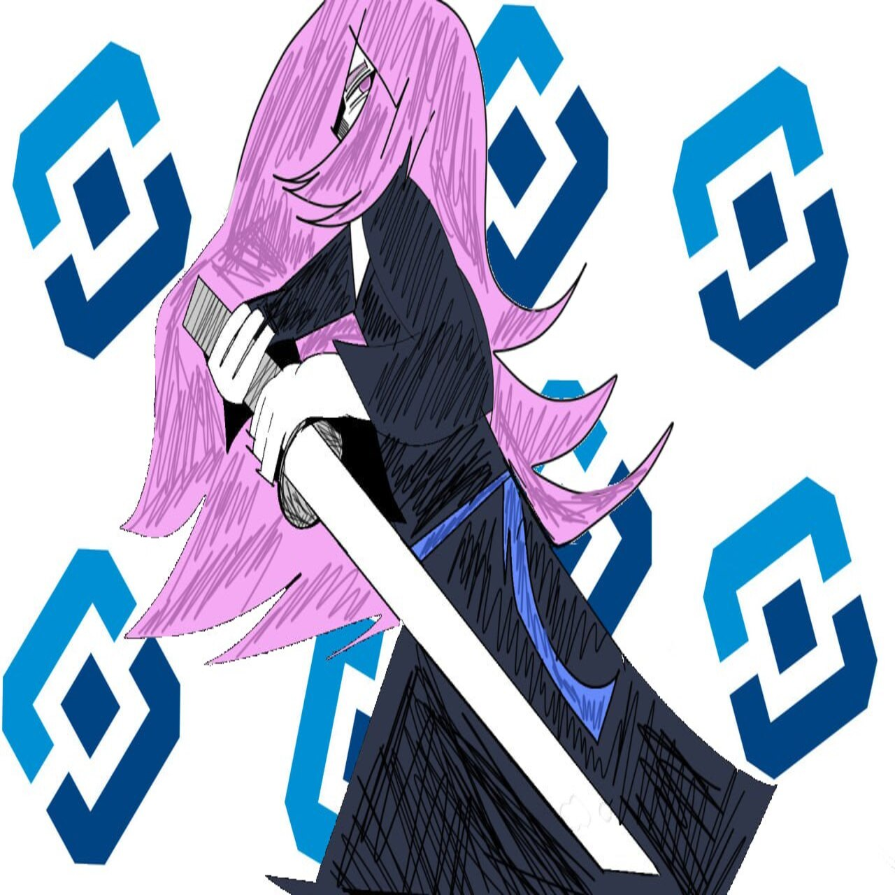

# KG-Zapret

# Копия Zapret GUI на C# без premium/donate функционала и пошустрее

## АХТУНГ-БУДАХТУНГ! ШНЕЛЯ ШНЕЛЯ ЯВОЛЬ УНД МОЛЬ!

Я - НЕ ПРИДИРАЮСЬ К Zapret GUI от Bot-Yan`а, вся его команда молодцы и просто крутые чуваки (хоть и в проекте юзали ИИ (как я понял DeepSeek), но я не осуждаю - нужен продукт для продажи). И я не конкурирую с ними - данный репозиторий ваще ток чтобы друзьям/знакомым/друзьям друзей давать и показывать "хехехе, сматри шо я сделал", ну и потому что "Python - тормоз!".

Короче - авторы молодцы, я - левый чел

**ПРОЕКТ В СТАДИИ ЗАРОДЫША - МОЖЕТ ВСЁ ОТВАЛИВАТЬСЯ И БЫТЬ ОЧЕНЬ-ОЧЕНЬ ПЛОХИМ!**

## Шо тут такое?

- Все темы доступны (убраны ограничения premium)
- Повторена вся графика и UI оригинального приложения
- WPF с Material Design (потому что у меня пока что нету линукса, если интересно почему переходи в [мой ТГК](https://t.me/kanal_kashkamalhika))
- MVVM архитектура (сложное слово, но я [для вас загуглил!](https://www.google.com/search?q=MVVM+%D0%B0%D1%80%D1%85%D0%B8%D1%82%D0%B5%D0%BA%D1%82%D1%83%D1%80%D0%B0&oq=MVVM+%D0%B0%D1%80%D1%85%D0%B8%D1%82%D0%B5%D0%BA%D1%82%D1%83%D1%80%D0%B0&gs_lcrp=EgZjaHJvbWUyCQgAEEUYORiABDIHCAEQABiABDIICAIQABgWGB4yCAgDEAAYFhgeMggIBBAAGBYYHjIICAUQABgWGB4yCAgGEAAYFhgeMggIBxAAGBYYHjIKCAgQABgKGBYYHjIICAkQABgWGB7SAQc1MTlqMGo3qAIIsAIB8QVXxJDtxGSktQ&sourceid=chrome&ie=UTF-8))
- Dependency Injection

## Запуск

Требуется .NET 8.0 и мозг (если нету в наличии - ничего страшного, подумайте. Если не получилось - подумайте ещё, и так далее по хронологии)

## Как собрать или "Памагите я тупой"

[Тыкай сюды](https://github.com/UbicaTravy/KG-Zapret/blob/main/OTHER/HOW_TO_BUILD.md)

## TODO

- реализовать работу с winws.exe
- реализовать загрузку стратегий
- реализовать DNS настройки
- реализовать системный трей
- добавить все темы оформления
- реализовать автозапуск
- чё то ещё, но я забыл что

## Авторы

- Программист - KillerGrass <- кшк мальчик

- Художник (рисовал аву для проги) - Toter Schädel
